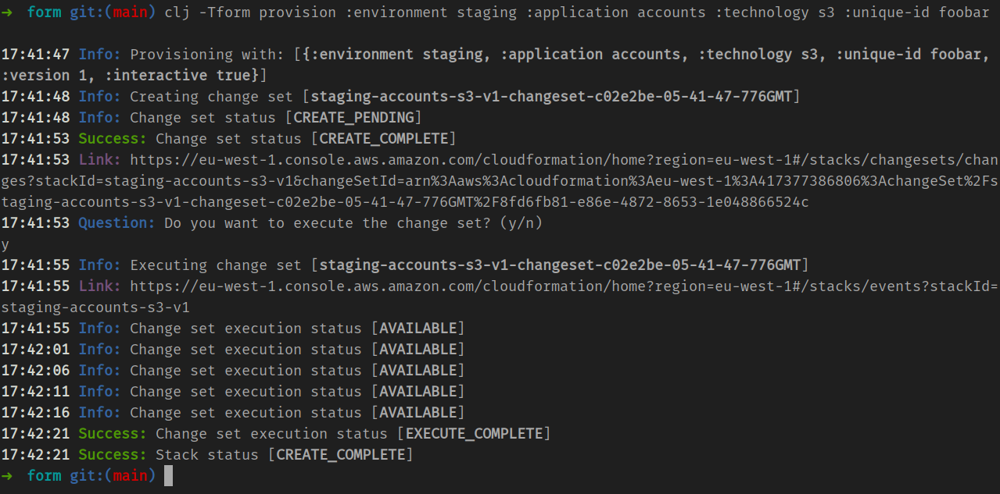

# form

A simple but *opinionated* command-line tool for organising and managing project-specific AWS resources within Clojure projects. 

## What are its opinions? 
Five parameters establish the provisioning context: 

- `:organisation` (a short-n-snappy for your organisation) 
- `:environment` (e.g. `staging`, `prod`, `uat`, `qa`) 
- `:application` (your project name) 
- `:technology` (e.g. `s3`, `rds`, etc) 
- `:version` (major version number defaulting to version 1) 

Any generated stacks are named accordingly, for example, if you're provisioning an `rds` stack for a service called `accounts` in `staging` and your organisation is called `acme` the resulting stack name will be `acme-staging-accounts-rds-v1`.

CloudFormation template files corresponding to these stacks must reside within a `cloudformation/` folder on the classpath of your project e.g. in `resources/cloudformation/` 

Each template file must be named `template-<technology>.yml` according to what its consistuent resources relate to, for example: 

```
resources/cloudformation/
├── template-main.yml
├── template-rds.yml
└── template-s3.yml
```

__Note:__ it's sensible to group resources being managed according to established AWS names such as `rds`, but actually the `<technology>` name can be anything. For instance, in the list of examples templates shown above, `main` is used as the technology name for the ECS resources associated with the main application of the project. 

If you're not interested in partitioning the resources for your project, you *could* have one `<technology>` grouping entitled `all` or `uber` and one corresponding `template-uber.yml`, but managing the lifecycle of all resources in one stack has its downsides, so this usage is not advised. 

## Installation 

If you've cloned `form` locally and want to install and use a modified version, you can: 

```
just install
```

Otherwise, if you want to install a specific release from GitHub, on a CI machine for example: 

```
clj -Ttools install com.github.codeasone/form '{:git/tag "2023.11.04"}' :as form
```

Once installed on a system, `form` can be run anywhere using `clj -Tform` 

## Prerequisites 

A Clojure installation on the machine or container you want to run `form`. 

And also appropriately configured AWS credentials. 

## Usage 

Here's a fully specified invocation of `form` to provision the `s3` resources in `resources/cloudformation/template-s3.yml` for the `accounts` application on `staging`: 

```
clj -Tform provision :organisation form :environment staging :application accounts :technology s3 :version 1
``` 

An example `template-s3.yml` with a single test bucket resource is provided so you can try running this yourself right away. Just be sure to choose a unique enough `:organisation` and `:application` name combo to ensure that the underlying bucket name does not collide with one that already exists. 



If `:version` is not provided then the default value of `1` is used and resulting stacks will be suffixed `v1`. 

By default `form` runs with `:interactive true` and will prompt you to check and confirm the status of any planned changes . 

For CI usage, this mode can be disabled with `:interactive false`. 

## Safety 

If `:environment` is equal to `production` then any stacks created with `form` have termination protection enabled automatically, making them harder to accidentally delete in the event that you have sufficient IAM privileges to delete stacks to begin with...

## Limitations 

Currently there is no support for automating the deletion of stacks created with `form`, but this will be added to a subsequent release. 

To delete stacks created with `form` you'll need to use the AWS console or another tool. 

## Why not just use the awscli tool? 

Using `form` is as much about introducing a structured and consistent approach to naming, grouping, and managing AWS resources within an organisation, as being a handy tool. 

It will work well in environments consisting of 10s or 100s of services, deployed across multiple environments, where there needs to be a quick answer to the questions like "what resources is project 'foo' using in 'staging'?" 

But it also works well for individual projects too. 

The UX of `form` has been developed and used in numerous incarnations by multiple teams over the past 7 years or so. For both local IaC development and debugging workflows, as well as in the context of numerous CI testing rigs. 

The visual output, handy console links, and timestamped status updates, together with the interactive features, are field tested and have proven to be useful enough to merit the creation of this tool. 

## Development 

With its current incarnation in Clojure code, the `form` tooling is fully testable and debuggable via standard REPL-based workflows.

To run the integration tests, first bring up `localstack` with `docker-compose up` and when port `4566` is available you can: 

```
just test
```

Or alternatively invocate tests from your editor or REPL, as you prefer.

## Next steps 

- Add a `clj -Tform help` command and output usage information whenever `clj -Tform` is called without any command 
- Expand on the `README.md`, in particular in relation to AWS credentials setup and the UX advantages
- Document usage of AWS System Manager Parameter Store as the recommend approach for managing additional stack parameters including references to resources provisioned manually or using `terraform` for instance
- Add support for passing additional stack parameters as keyword-value pairs to `clj -Tform provision` (maybe) 
- Improve error handling and messaging 
- Support automated deletion of non-production stacks, to support programmatic teardown of `nightly` test environments
- Add GitHub `test` workflow to regression test future pushes and pull_requests
- Add more tests 
